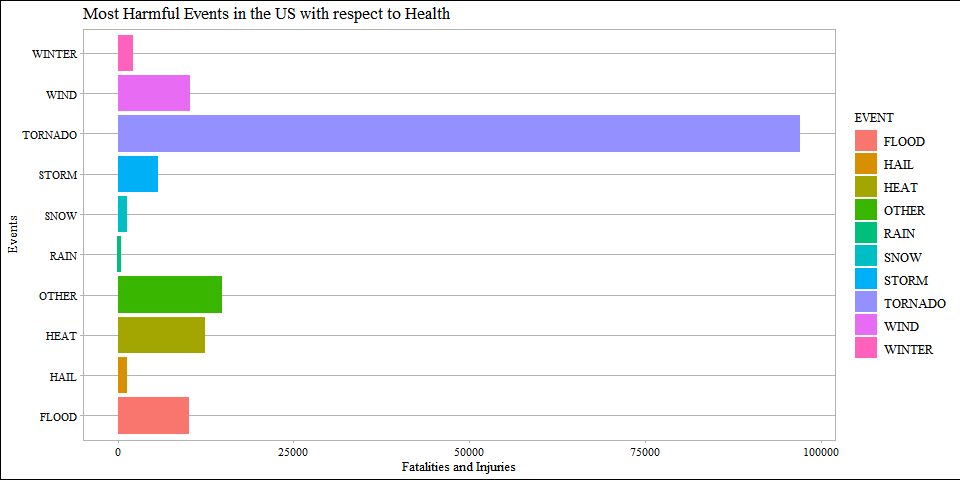
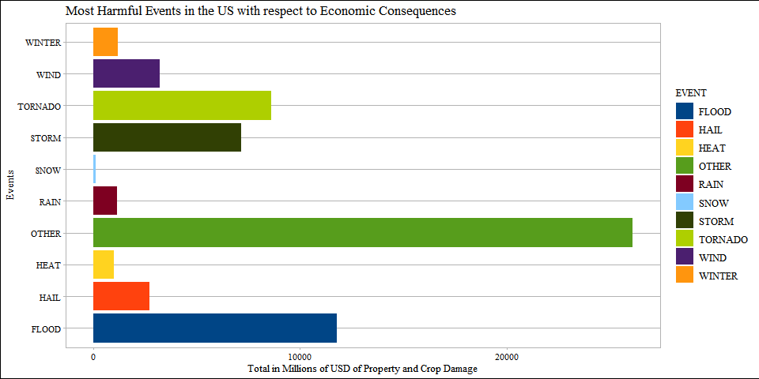

# **Analysis of the Impact of Different Weather Conditons on Health and the Economy**

# Introduction

Storms and other severe weather events can cause both public health and economic problems for communities and municipalities. Many severe events can result in fatalities, injuries, and property damage, and preventing such outcomes to the extent possible is a key concern.

This project involves exploring the U.S. National Oceanic and Atmospheric Administration's (NOAA) storm database. This database tracks characteristics of major storms and weather events in the United States, including when and where they occur, as well as estimates of any fatalities, injuries, and property damage.

# Data

The data for this assignment come in the form of a comma-separated-value file compressed via the bzip2 algorithm to reduce its size. You can download the file from the course web site.

The events in the database start in the year 1950 and end in November 2011. In the earlier years of the database there are generally fewer events recorded, most likely due to a lack of good records. More recent years should be considered more complete.

## **Assignment**

The basic goal of this assignment is to explore the NOAA Storm Database and answer some basic questions about severe weather events. You must use the database to answer the questions below and show the code for your entire analysis. Your analysis can consist of tables, figures, or other summaries. You may use any R package you want to support your analysis.

**Questions**

Your data analysis must address the following questions:

  - Across the United States, which types of events (as indicated in the EVTYPE variable) are most harmful with respect to population health?
  - Across the United States, which types of events have the greatest economic consequences?
  
Consider writing your report as if it were to be read by a government or municipal manager who might be responsible for preparing for severe weather events and will need to prioritize resources for different types of events. However, there is no need to make any specific recommendations in your report.

## **Setting Global Options**


```r
knitr::opts_chunk$set(echo = TRUE, warning = FALSE, fig.width = 10, fig.height = 5,
                      fig.keep = 'all' ,fig.path = 'figures\ ', dev = 'png')
```

## **Loading and Examining Data**


```r
# Loading packages
library(ggplot2)
library(ggthemes)
library(dplyr)
```

```
## 
## Attaching package: 'dplyr'
```

```
## The following objects are masked from 'package:stats':
## 
##     filter, lag
```

```
## The following objects are masked from 'package:base':
## 
##     intersect, setdiff, setequal, union
```

```r
library(plyr)
```

```
## ------------------------------------------------------------------------------
```

```
## You have loaded plyr after dplyr - this is likely to cause problems.
## If you need functions from both plyr and dplyr, please load plyr first, then dplyr:
## library(plyr); library(dplyr)
```

```
## ------------------------------------------------------------------------------
```

```
## 
## Attaching package: 'plyr'
```

```
## The following objects are masked from 'package:dplyr':
## 
##     arrange, count, desc, failwith, id, mutate, rename, summarise,
##     summarize
```

```r
# Reading the data
stormData <- read.csv(bzfile("repdata_data_StormData.csv.bz2"))

# Examining dimesions of stormData
dim(stormData)
```

```
## [1] 902297     37
```


```r
# Examining the variables of stormData
str(stormData)
```

```
## 'data.frame':	902297 obs. of  37 variables:
##  $ STATE__   : num  1 1 1 1 1 1 1 1 1 1 ...
##  $ BGN_DATE  : chr  "4/18/1950 0:00:00" "4/18/1950 0:00:00" "2/20/1951 0:00:00" "6/8/1951 0:00:00" ...
##  $ BGN_TIME  : chr  "0130" "0145" "1600" "0900" ...
##  $ TIME_ZONE : chr  "CST" "CST" "CST" "CST" ...
##  $ COUNTY    : num  97 3 57 89 43 77 9 123 125 57 ...
##  $ COUNTYNAME: chr  "MOBILE" "BALDWIN" "FAYETTE" "MADISON" ...
##  $ STATE     : chr  "AL" "AL" "AL" "AL" ...
##  $ EVTYPE    : chr  "TORNADO" "TORNADO" "TORNADO" "TORNADO" ...
##  $ BGN_RANGE : num  0 0 0 0 0 0 0 0 0 0 ...
##  $ BGN_AZI   : chr  "" "" "" "" ...
##  $ BGN_LOCATI: chr  "" "" "" "" ...
##  $ END_DATE  : chr  "" "" "" "" ...
##  $ END_TIME  : chr  "" "" "" "" ...
##  $ COUNTY_END: num  0 0 0 0 0 0 0 0 0 0 ...
##  $ COUNTYENDN: logi  NA NA NA NA NA NA ...
##  $ END_RANGE : num  0 0 0 0 0 0 0 0 0 0 ...
##  $ END_AZI   : chr  "" "" "" "" ...
##  $ END_LOCATI: chr  "" "" "" "" ...
##  $ LENGTH    : num  14 2 0.1 0 0 1.5 1.5 0 3.3 2.3 ...
##  $ WIDTH     : num  100 150 123 100 150 177 33 33 100 100 ...
##  $ F         : int  3 2 2 2 2 2 2 1 3 3 ...
##  $ MAG       : num  0 0 0 0 0 0 0 0 0 0 ...
##  $ FATALITIES: num  0 0 0 0 0 0 0 0 1 0 ...
##  $ INJURIES  : num  15 0 2 2 2 6 1 0 14 0 ...
##  $ PROPDMG   : num  25 2.5 25 2.5 2.5 2.5 2.5 2.5 25 25 ...
##  $ PROPDMGEXP: chr  "K" "K" "K" "K" ...
##  $ CROPDMG   : num  0 0 0 0 0 0 0 0 0 0 ...
##  $ CROPDMGEXP: chr  "" "" "" "" ...
##  $ WFO       : chr  "" "" "" "" ...
##  $ STATEOFFIC: chr  "" "" "" "" ...
##  $ ZONENAMES : chr  "" "" "" "" ...
##  $ LATITUDE  : num  3040 3042 3340 3458 3412 ...
##  $ LONGITUDE : num  8812 8755 8742 8626 8642 ...
##  $ LATITUDE_E: num  3051 0 0 0 0 ...
##  $ LONGITUDE_: num  8806 0 0 0 0 ...
##  $ REMARKS   : chr  "" "" "" "" ...
##  $ REFNUM    : num  1 2 3 4 5 6 7 8 9 10 ...
```

## **Extracting Variables of Interest**

To analyse the impact of different weather conditions, it is  needful to extract the relevant variable data from the dataset.

- Weather Events Variable 
  - EVTYPE: type of weather event (TORNADO, FLOOD etc)

- Health variables
  - FATALITIES: number of deaths
  - INJURIES: number of injuries

- Economic variables 
  - PROPDMG: property damage
  - PROPDMGEXP: units for property damage value
  - CROPDMG: crop damage
  - CROPDMGEXP: units for crop damage value


```r
# Extracting the relevant variable data from stormData
variables <- c("EVTYPE", "FATALITIES", "INJURIES", "PROPDMG", "PROPDMGEXP", "CROPDMG", "CROPDMGEXP")
subsetStormData <- stormData[ , variables]

# Viewing the subset 
str(subsetStormData)
```

```
## 'data.frame':	902297 obs. of  7 variables:
##  $ EVTYPE    : chr  "TORNADO" "TORNADO" "TORNADO" "TORNADO" ...
##  $ FATALITIES: num  0 0 0 0 0 0 0 0 1 0 ...
##  $ INJURIES  : num  15 0 2 2 2 6 1 0 14 0 ...
##  $ PROPDMG   : num  25 2.5 25 2.5 2.5 2.5 2.5 2.5 25 25 ...
##  $ PROPDMGEXP: chr  "K" "K" "K" "K" ...
##  $ CROPDMG   : num  0 0 0 0 0 0 0 0 0 0 ...
##  $ CROPDMGEXP: chr  "" "" "" "" ...
```

## **Transforming and Cleaning the Extracted Variables**


```r
# Viewing the types that feature the most in the variable EVTYPE
sort(table(subsetStormData$EVTYPE), decreasing = TRUE)[1:10]
```

```
## 
##               HAIL          TSTM WIND  THUNDERSTORM WIND            TORNADO 
##             288661             219940              82563              60652 
##        FLASH FLOOD              FLOOD THUNDERSTORM WINDS          HIGH WIND 
##              54277              25326              20843              20212 
##          LIGHTNING         HEAVY SNOW 
##              15754              15708
```

Grouping the types in the variable EVTYPE according to common keywords like HEAT, TORNADO, FLOOD etc-


```r
# Creating a new variable to transform EVTYPE into groups 
subsetStormData$EVENT <- "OTHER"

# Grouping types in EVTYPE by keywords

subsetStormData$EVENT[grepl("HEAT", subsetStormData$EVTYPE, ignore.case = TRUE)] <- "HEAT"
subsetStormData$EVENT[grepl("HAIL", subsetStormData$EVTYPE, ignore.case = TRUE)] <- "HAIL"
subsetStormData$EVENT[grepl("SNOW", subsetStormData$EVTYPE, ignore.case = TRUE)] <- "SNOW"
subsetStormData$EVENT[grepl("WIND", subsetStormData$EVTYPE, ignore.case = TRUE)] <- "WIND"
subsetStormData$EVENT[grepl("STORM", subsetStormData$EVTYPE, ignore.case = TRUE)] <- "STORM"
subsetStormData$EVENT[grepl("TORNADO", subsetStormData$EVTYPE, ignore.case = TRUE)] <- "TORNADO"
subsetStormData$EVENT[grepl("FLOOD", subsetStormData$EVTYPE, ignore.case = TRUE)] <- "FLOOD"
subsetStormData$EVENT[grepl("WINTER", subsetStormData$EVTYPE, ignore.case = TRUE)] <- "WINTER"
subsetStormData$EVENT[grepl("RAIN", subsetStormData$EVTYPE, ignore.case = TRUE)] <- "RAIN"

# Viewing the groups
sort(table(subsetStormData$EVENT), decreasing = TRUE)[1:10]
```

```
## 
##    HAIL    WIND   STORM   FLOOD TORNADO   OTHER  WINTER    SNOW    RAIN    HEAT 
##  289270  255380  113173   82703   60700   48970   19604   17608   12241    2648
```


Crop Damage and Property Damage values are defined in exponential terms - 


```r
# Viewing Property Damage
table(subsetStormData$PROPDMGEXP)
```

```
## 
##             -      ?      +      0      1      2      3      4      5      6 
## 465934      1      8      5    216     25     13      4      4     28      4 
##      7      8      B      h      H      K      m      M 
##      5      1     40      1      6 424665      7  11330
```


```r
# Viewing Crop Damage
table(subsetStormData$CROPDMGEXP)
```

```
## 
##             ?      0      2      B      k      K      m      M 
## 618413      7     19      1      9     21 281832      1   1994
```

Creating factor variables to bring the values of damage to the same base (Millions of USD$) -


```r
# Creating new variable to standardise PROPDMGEXP to Millions USD
subsetStormData$propDmgValue <- 0.000001

# Setting values according to the exponential powers
subsetStormData$propDmgValue[subsetStormData$PROPDMGEXP =="1"] <- 0.00001
subsetStormData$propDmgValue[subsetStormData$PROPDMGEXP =="2"] <- 0.0001
subsetStormData$propDmgValue[subsetStormData$PROPDMGEXP =="3"] <- 0.001
subsetStormData$propDmgValue[subsetStormData$PROPDMGEXP =="4"] <- 0.01
subsetStormData$propDmgValue[subsetStormData$PROPDMGEXP =="5"] <- 0.1
subsetStormData$propDmgValue[subsetStormData$PROPDMGEXP =="6"] <- 1
subsetStormData$propDmgValue[subsetStormData$PROPDMGEXP =="7"] <- 10
subsetStormData$propDmgValue[subsetStormData$PROPDMGEXP =="8"] <- 100
subsetStormData$propDmgValue[subsetStormData$PROPDMGEXP =="B"] <- 1000
subsetStormData$propDmgValue[subsetStormData$PROPDMGEXP =="h"] <- 0.0001
subsetStormData$propDmgValue[subsetStormData$PROPDMGEXP =="H"] <- 0.0001
subsetStormData$propDmgValue[subsetStormData$PROPDMGEXP =="K"] <- 0.001
subsetStormData$propDmgValue[subsetStormData$PROPDMGEXP =="m"] <- 1
subsetStormData$propDmgValue[subsetStormData$PROPDMGEXP =="M"] <- 1

# Viewing property damage values
table(subsetStormData$propDmgValue)
```

```
## 
##  1e-06  1e-05  1e-04  0.001   0.01    0.1      1     10    100   1000 
## 466164     25     20 424669      4     28  11341      5      1     40
```


```r
# Creating a new variable to standardise CROPDMGEXP to Millions USD
subsetStormData$cropDmgValue <- 0.000001

# Setting values according to the exponential powers
subsetStormData$cropDmgValue[subsetStormData$CROPDMGEXP =="2"] <- 0.0001
subsetStormData$cropDmgValue[subsetStormData$CROPDMGEXP =="B"] <- 1000
subsetStormData$cropDmgValue[subsetStormData$CROPDMGEXP =="k"] <- 0.001
subsetStormData$cropDmgValue[subsetStormData$CROPDMGEXP =="K"] <- 0.001
subsetStormData$cropDmgValue[subsetStormData$CROPDMGEXP =="m"] <- 1
subsetStormData$cropDmgValue[subsetStormData$CROPDMGEXP =="M"] <- 1

# Viewing crop damage values
table(subsetStormData$cropDmgValue)
```

```
## 
##  1e-06  1e-04  0.001      1   1000 
## 618439      1 281853   1995      9
```

## **Aggregating Events for Health Variables**


```r
# Aggregating fatalities and injuries by type of event 
aggregateFatalitiesandInjuries <- ddply(subsetStormData, .(EVENT), summarise, 
                                       Total = sum(FATALITIES + INJURIES, na.rm = TRUE))
# Changing the col name
aggregateFatalitiesandInjuries$type <- "Fatalities and Injuries"

aggregateFatalitiesandInjuries
```

```
##      EVENT Total                    type
## 1    FLOOD 10128 Fatalities and Injuries
## 2     HAIL  1386 Fatalities and Injuries
## 3     HEAT 12362 Fatalities and Injuries
## 4    OTHER 14850 Fatalities and Injuries
## 5     RAIN   419 Fatalities and Injuries
## 6     SNOW  1280 Fatalities and Injuries
## 7    STORM  5753 Fatalities and Injuries
## 8  TORNADO 97068 Fatalities and Injuries
## 9     WIND 10258 Fatalities and Injuries
## 10  WINTER  2169 Fatalities and Injuries
```


```r
# Aggregating fatalities by type of event 
aggregateFatalities <- ddply(subsetStormData, .(EVENT), summarise, 
                                       Total = sum(FATALITIES, na.rm = TRUE))
# Changing the col name
aggregateFatalities$type <- "Fatalities"

aggregateFatalities
```

```
##      EVENT Total       type
## 1    FLOOD  1524 Fatalities
## 2     HAIL    15 Fatalities
## 3     HEAT  3138 Fatalities
## 4    OTHER  2626 Fatalities
## 5     RAIN   114 Fatalities
## 6     SNOW   159 Fatalities
## 7    STORM   416 Fatalities
## 8  TORNADO  5661 Fatalities
## 9     WIND  1214 Fatalities
## 10  WINTER   278 Fatalities
```


```r
# Aggregating injuries by type of event 
aggregateInjuries <- ddply(subsetStormData, .(EVENT), summarise, 
                                      Total = sum(INJURIES, na.rm = TRUE))
# Changing the col name
aggregateInjuries$type <- "Injuries"

aggregateInjuries
```

```
##      EVENT Total     type
## 1    FLOOD  8604 Injuries
## 2     HAIL  1371 Injuries
## 3     HEAT  9224 Injuries
## 4    OTHER 12224 Injuries
## 5     RAIN   305 Injuries
## 6     SNOW  1121 Injuries
## 7    STORM  5337 Injuries
## 8  TORNADO 91407 Injuries
## 9     WIND  9044 Injuries
## 10  WINTER  1891 Injuries
```


```r
# Combining all variables
aggregateHealth <- rbind(aggregateFatalities, aggregateInjuries)

# Separating Fatalities and Injuries by event
healthByEvent <- join(aggregateFatalities, aggregateInjuries, by = "EVENT", type = "inner")
healthByEvent
```

```
##      EVENT Total       type Total     type
## 1    FLOOD  1524 Fatalities  8604 Injuries
## 2     HAIL    15 Fatalities  1371 Injuries
## 3     HEAT  3138 Fatalities  9224 Injuries
## 4    OTHER  2626 Fatalities 12224 Injuries
## 5     RAIN   114 Fatalities   305 Injuries
## 6     SNOW   159 Fatalities  1121 Injuries
## 7    STORM   416 Fatalities  5337 Injuries
## 8  TORNADO  5661 Fatalities 91407 Injuries
## 9     WIND  1214 Fatalities  9044 Injuries
## 10  WINTER   278 Fatalities  1891 Injuries
```

## **Aggregating Events for Economic Variables**


```r
# Aggregating property and crop damage by type of event 
aggregatePropandCropDmg <- ddply(subsetStormData, .(EVENT), summarise, 
                                       Total = sum(propDmgValue + cropDmgValue, na.rm = TRUE))
# Changing the col name
aggregatePropandCropDmg$type <- "Property and Crop Damage"

aggregatePropandCropDmg
```

```
##      EVENT      Total                     type
## 1    FLOOD 11814.0173 Property and Crop Damage
## 2     HAIL  2724.4773 Property and Crop Damage
## 3     HEAT  1018.7116 Property and Crop Damage
## 4    OTHER 26117.3842 Property and Crop Damage
## 5     RAIN  1154.0963 Property and Crop Damage
## 6     SNOW   149.5546 Property and Crop Damage
## 7    STORM  7160.7808 Property and Crop Damage
## 8  TORNADO  8633.2410 Property and Crop Damage
## 9     WIND  3240.6314 Property and Crop Damage
## 10  WINTER  1183.5545 Property and Crop Damage
```


```r
# Aggregating property damage by type of event 
aggregatePropDmg <- ddply(subsetStormData, .(EVENT), summarise, 
                                       Total = sum(propDmgValue, na.rm = TRUE))
# Changing the col name
aggregatePropDmg$type <- "Property Damage"

aggregatePropDmg
```

```
##      EVENT       Total            type
## 1    FLOOD 10229.41468 Property Damage
## 2     HAIL  2072.31359 Property Damage
## 3     HEAT    10.35828 Property Damage
## 4    OTHER 19738.95800 Property Damage
## 5     RAIN  1087.81935 Property Damage
## 6     SNOW   132.92267 Property Damage
## 7    STORM  5945.95641 Property Damage
## 8  TORNADO  8536.67789 Property Damage
## 9     WIND  3003.37525 Property Damage
## 10  WINTER  1161.18128 Property Damage
```


```r
# Aggregating crop damage by type of event 
aggregateCropDmg <- ddply(subsetStormData, .(EVENT), summarise, 
                                       Total = sum(cropDmgValue, na.rm = TRUE))
# Changing the col name
aggregateCropDmg$type <- "Crop Damage"

aggregateCropDmg
```

```
##      EVENT      Total        type
## 1    FLOOD 1584.60260 Crop Damage
## 2     HAIL  652.16374 Crop Damage
## 3     HEAT 1008.35329 Crop Damage
## 4    OTHER 6378.42621 Crop Damage
## 5     RAIN   66.27691 Crop Damage
## 6     SNOW   16.63198 Crop Damage
## 7    STORM 1214.82434 Crop Damage
## 8  TORNADO   96.56310 Crop Damage
## 9     WIND  237.25614 Crop Damage
## 10  WINTER   22.37323 Crop Damage
```


```r
# Combining all variables
aggregateEconomy <- rbind(aggregatePropDmg, aggregateCropDmg)

# Separating Fatalities and Injuries by event
economyByEvent <- join(aggregatePropDmg, aggregateCropDmg, by = "EVENT", type = "inner")
economyByEvent
```

```
##      EVENT       Total            type      Total        type
## 1    FLOOD 10229.41468 Property Damage 1584.60260 Crop Damage
## 2     HAIL  2072.31359 Property Damage  652.16374 Crop Damage
## 3     HEAT    10.35828 Property Damage 1008.35329 Crop Damage
## 4    OTHER 19738.95800 Property Damage 6378.42621 Crop Damage
## 5     RAIN  1087.81935 Property Damage   66.27691 Crop Damage
## 6     SNOW   132.92267 Property Damage   16.63198 Crop Damage
## 7    STORM  5945.95641 Property Damage 1214.82434 Crop Damage
## 8  TORNADO  8536.67789 Property Damage   96.56310 Crop Damage
## 9     WIND  3003.37525 Property Damage  237.25614 Crop Damage
## 10  WINTER  1161.18128 Property Damage   22.37323 Crop Damage
```

# **Results**

# Question 1 - Across the United States, which types of events (as indicated in the EVTYPE variable) are most harmful with respect to population health?


```r
# Transforming events in aggregateHeath to a factor
aggregateHealth$EVENT <- as.factor(aggregateHealth$EVENT)

# Plotting into ggplot2
healthPlot <- ggplot(data = aggregateHealth, aes(x = EVENT, y = Total, fill = EVENT)) +
  geom_bar(stat = "identity") +
  coord_flip() +
  xlab("Events") +
  ylab("Fatalities and Injuries") +
  ggtitle("Most Harmful Events in the US with respect to Health") +
  theme_calc(base_family = "serif")

print(healthPlot)
```



# Question 2 - Across the United States, which types of events have the greatest economic consequences?


```r
# Transforming events in aggregateEconomy to a factor
aggregateEconomy$EVENT <- as.factor(aggregateEconomy$EVENT)

# Plotting into ggplot2
economyPlot <- ggplot(data = aggregateEconomy, aes(x = EVENT, y = Total, fill = EVENT)) +
  geom_bar(stat = "identity") +
  coord_flip() +
  xlab("Events") +
  ylab("Total in Millions of USD of Property and Crop Damage") +
  ggtitle("Most Harmful Events in the US with respect to Economic Consequences") +
  theme_calc(base_family = "serif") +
  scale_fill_calc()

print(economyPlot)
```



**---------------------------------------------------------------------------------------------------**
